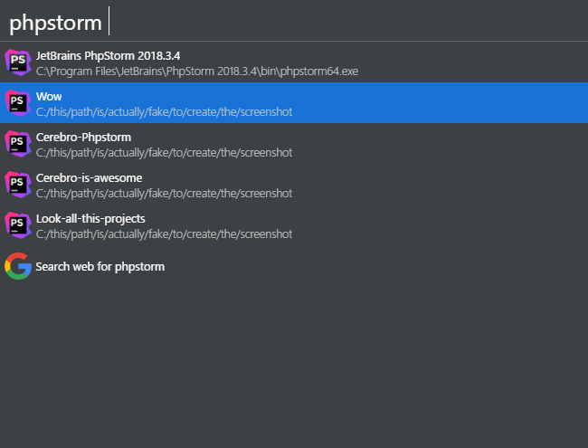

# cerebro-phpstorm

> [Cerebro](http://www.cerebroapp.com) plugin to launch PhpStorm Projects

It will find the phpstorm config directory and fetch all the recent project directories.

## Requirements

PhpStorm needs to be part of your PATH enviroment variable. If you're using Windows it may be already configurated but on Linux and macOS you have to do it manually.

Check the [jetbrains documentation](https://www.jetbrains.com/help/phpstorm/working-with-the-ide-features-from-command-line.html#launchers-macos-linux) on how to do it.

## Usage

In Cerebro, type `php` or `phpstorm` and some text, to find and select recent PhpStorm project files.

Select the project you want to open and cerebro will launch it in PhpStorm

## License

MIT © [Alvaro Tinoco](https://github.com/mrmarble)